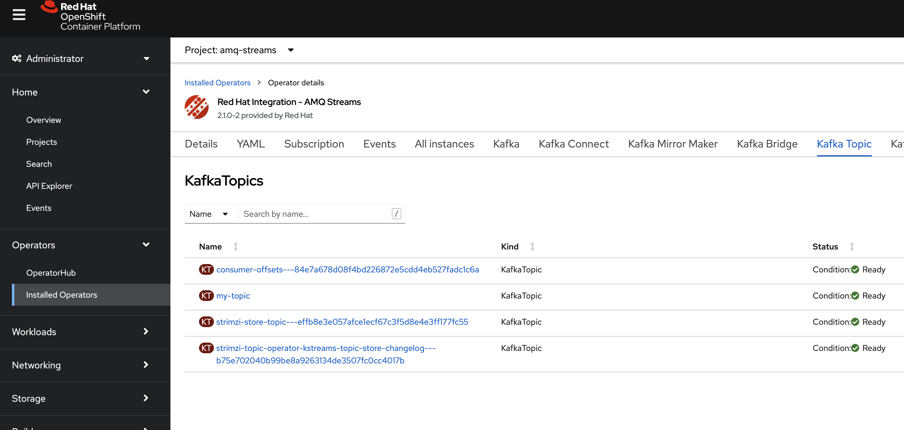

# Quick Start Kafka with AMQ Streams on OpenShift


- Create Project AMQ Streams
  - create project with command line
    ```bash
    oc new-project amq-streams
    ```
  - or create on developer console
    
- Install AMQ Streams from Operator Hub
  - go to admin perspective
  - operator hub
  - search "AMQ Streams"
    
  - install AMQ Streams at namespace "amq-streams"
    
- Create Kafka Cluster
  - go to namespace "amq-streams"
  - create kafka cluster
    ```bash
    oc project amq-streams
    oc apply -f cluster.yaml
    ```
  - check kafka cluster
    ```bash
    oc get all -n amq-streams
    ```
  - view kafka cluster in developer console, wait until complete
    
- Create Kafka Topic
  - create kafka topic
    ```bash
    oc apply -f topic.yaml
    ```
  - check kafka topic
    ```bash
    oc get kt
    ```
  - vew kafka topic from console
    
- Create Producer
  - create producer
    ```bash
    oc apply -f producer.yaml
    ```
  - view log
    ```bash
    oc logs -n amq-streams -f $(oc get pods -l app=hello-world-producer -o name)
    ```
- Create Consumer
  - create consumer
    ```bash
    oc apply -f consumer.yaml
    #option, run multiple consumer group
    #oc apply -f consumer2.yaml
    #oc apply -f consumer3.yaml
    #oc apply -f consumer4.yaml
    #oc apply -f consumer5.yaml
    ```
  - view log 
    ```bash
    oc get pods -l app=hello-world-consumer -o name
    oc logs -n amq-streams -f <first pod from above command>
    ```
    or view by developer console
    
- Optional
  - producer/consumer example source code at --> https://github.com/strimzi/client-examples
  - test delete kafka broker
    
    for test delete broker pod, and wait until broker back to cluster and pv don't remove
    ```bash
    #separate terminal for each command
    oc get all -n amq-streams
    oc get pv,pvc -n amq-streams
    oc delete pods my-cluster-kafka-0 --grace-period=0
    ```
  - delete kafka topic
    
    for delete topic, clear persistent data
    ```bash
    oc delete kt my-topic
    ```